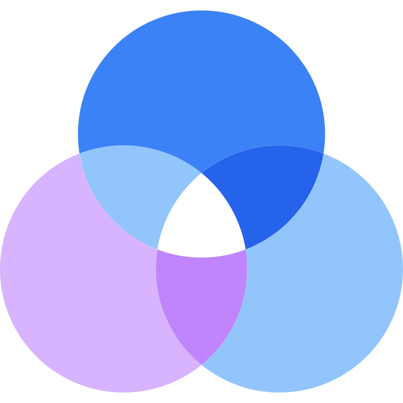
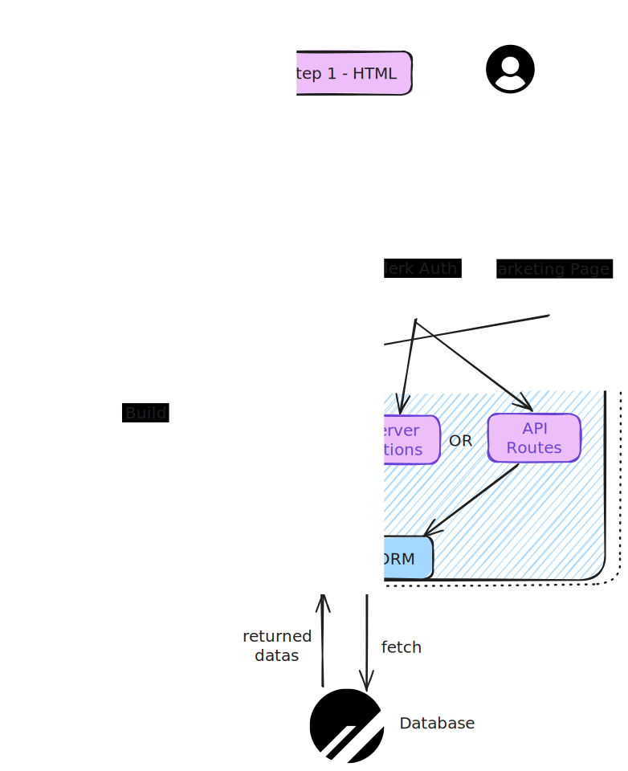

#  Taskify a Clone of Trello

For this project, my goal was to recreate a clone of the [Trello](https://trello.com/fr) web application using the [Next.js](https://nextjs.org/) framework, a library that leverages [ReactJS](https://fr.react.dev/) and [Node.js](https://nodejs.org/en) technologies. In terms of UI design, the app adopts the basic design of Trello, which in turn is an interpretation of the Kanban method. To achieve this result, I used the customizable components of [shadcn/ui](https://ui.shadcn.com/) and the [tailwind css](https://tailwindcss.com/) framework. For the server side, I implemented all the logic with Next.js [server actions](https://nextjs.org/docs/app/building-your-application/data-fetching/server-actions-and-mutations) and [api routes](https://nextjs.org/docs/pages/building-your-application/routing/api-routes), depending on their relevance. These communicate with a [MySQL](https://mysql.com/fr/) database via the [Prisma](https://www.prisma.io/) ORM. For authentication management, I chose a simple solution using [Clerk](https://clerk.dev/).

## Video Demo

<div align="center">
<a href="https://www.youtube.com/watch?v=3b8ArmeVFK8" target="_blank">
    
</a>
<br/>
<p style="font-style:italic">
  Demo of the application divided into 4 parts: Navigation, App Features, Subscription, Responsive Design
</p>
</div>

## App Demo

<p align="center">
  <a href="https://taskify-tmpt.vercel.app/" target="_blank">
   
  </a>
</p>

## Features

- 🖼️ **Landing Page** - to present the Taskify offer

- 🔐 **Login**, 🔏 **Register** for creating a new user and ❌**Delete** account

- 🏢 **Organization** create and manage organizations to separate boards

- 🌈 **Design**, matches that of _Trello_'s Web App

- 📲 **Responsive Design** - Adapts to all screen sizes, from mobile screens to desktop.

- 🗃️ **Kanban** - Create, Update, Copy, Delete **List** & **Card** , update Board **Title** on the fly

- 🤚 **Drag and Drop** - Features to drag and drop _Lists_ between them, but also _Cards_ inside any list

- 🔎 **Card Modal** - Functionality allowing the click of a card to display a modal containing all the options of a card: Update _Title_ & _Description_, _Delete_ & _Copy_, follow activities

- ✍️ **Subscription** - Possibility of subscribing to a Stripe subscription for each organization to unlock unlimited boards

- 💰 **Manage your subscriptions** - On each organization possibility of managing its subscription

- 👀 **Activity** - Page to check all log activities

## Libraries Used

- [Next.js](https://nextjs.org/) 
  - isomorphic framework allowing in particular the rendering of web pages on the server side

* [Typescript](https://www.typescriptlang.org/) 

  - TypeScript is an indispensable, strongly typed programming language that builds on JavaScript, enhancing it with type annotations and advanced features

* [Prisma](https://www.prisma.io/)  See [`prisma schema`](./prisma/schema.prisma)

  - an ORM working with several SGBD, MySQL in this application

* [Tailwind css](https://tailwindcss.com/) - See [`board-list example`](<./app/(platform)/(dashboard)/organization/[organizationId]/_components/board-list.tsx>)

  - A popular utility-first CSS framework for rapidly building custom user interfaces

* [Shadcn/ui](https://ui.shadcn.com/) - See [`components/ui`](./components/ui/)

  - This is a set of reusable components that you can copy and paste into your application. This library focused on accessibility, customization and open source is trendy and has experienced strong growth in 2023

* [Zod](https://zod.dev/)  - See [`zod-schema`](./actions/create-card/schema.ts)

* [Clerk](https://clerk.com/)  - See [`middleware.ts`](./middleware.ts)

  - tools to manage authentication

* [Stripe](https://clerk.com/) 

  - tools for payment management including subscriptions

## Conception

<div align="center">
    
<br/>

</div>
<br/>

This diagram explains the application architecture and its use of **Server Side Rendering** (SSR) by [Next.js](https://nextjs.org/).

Next.js, being an isomorphic framework, allows the same JavaScript code to be executed both on the _server_ and the _client_. This means that React components can be rendered server-side to generate the initial HTML _(Step 1)_, and then "hydrated" on the client-side _(Step 2)_ to allow dynamic interaction without requiring a full page load for each action.

Upon first connection, the client accesses the [landing-page](<./app/(marketing)>) and is then redirected to the authentication pages ([sign-in, sign-up, select-org](<./app/(platform)/(clerk)>)) managed and protected by the [middleware](./middleware.ts) of the Clerk tool. The **landing page** is a good example of a page rendered statically.

For this first project with Next.js, I wanted to experiment with data fetching through two Next.js features: [api routes](./app/api/) and [server actions](./actions/) (stable since version 14).

Regarding **API Routes**, I coupled them with the **react-query** library for its ease of use and also its cache data management (notably refetching keys).
As for **Server Actions**, this solution simplifies the execution of server logic without requiring dedicated API routes. However, through this solution, the entry point is not necessarily fully secure, especially for forms. Therefore, I created a [data verification function](./lib/create-safe-action.ts), taking the Zod schema as parameters as well as server logic and data retrieval. Finally, [use-action](./hooks/use-action.ts), on the client level, acts somewhat like the **useMutation** method of react-query, taking the action callback and success and error methods to display them at the client level.

For data fetching, I opted for the [ORM Prisma](./prisma/schema.prisma) which:

- Automatically generates a Prisma client based on our database schema,
- Is TypeScript friendly across the entire ecosystem,
- Manages MySQL,
- Allows simplified migration,
- Proposes schema-driven development,
- Enables intuitive query building.

For subscription management, Stripe manages user subscriptions through sessions.

## Quick Start Guide

### Prerequisites

**Node version 18.x.x**

### Cloning the repository

```shell
git clone git@github.com:tonympt/taskify.git
```

### Install packages

```shell
npm i
```

### Setup .env file

```js
NEXT_PUBLIC_CLERK_PUBLISHABLE_KEY=
CLERK_SECRET_KEY=
NEXT_PUBLIC_CLERK_SIGN_IN_URL=
NEXT_PUBLIC_CLERK_SIGN_UP_URL=
NEXT_PUBLIC_CLERK_AFTER_SIGN_IN_URL=
NEXT_PUBLIC_CLERK_AFTER_SIGN_UP_URL=

DATABASE_URL=

NEXT_PUBLIC_UNSPLASH_ACCESS_KEY=

STRIPE_API_KEY=

NEXT_PUBLIC_APP_URL=

STRIPE_WEBHOOK_SECRET=
```

### Setup Prisma

Add MySQL Database (On PlanetScale)

```shell
npx prisma generate
npx prisma db push
```

### Start the app

```shell
npm run dev
```

## Available commands

Running commands with npm `npm run [command]`

| command | description                              |
| :------ | :--------------------------------------- |
| `dev`   | Starts a development instance of the app |
